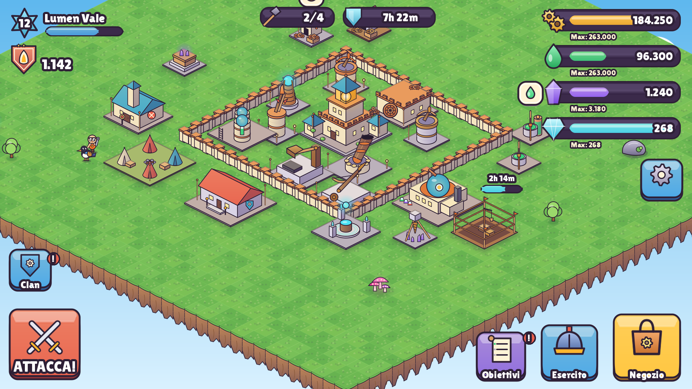
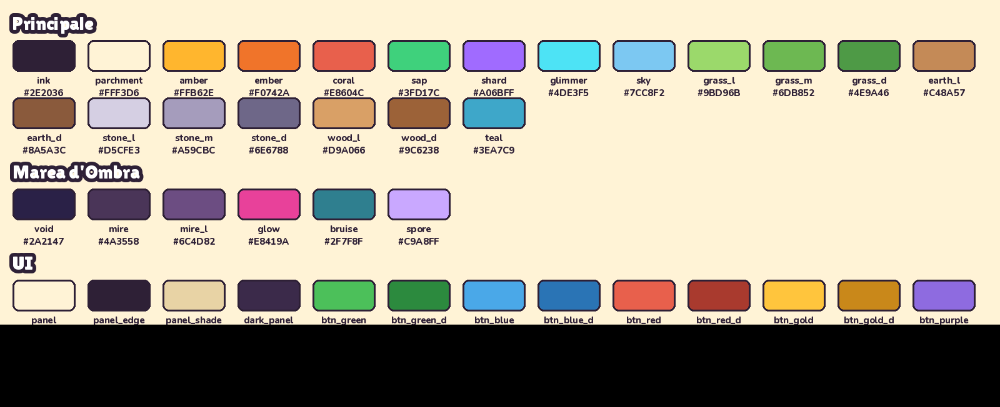
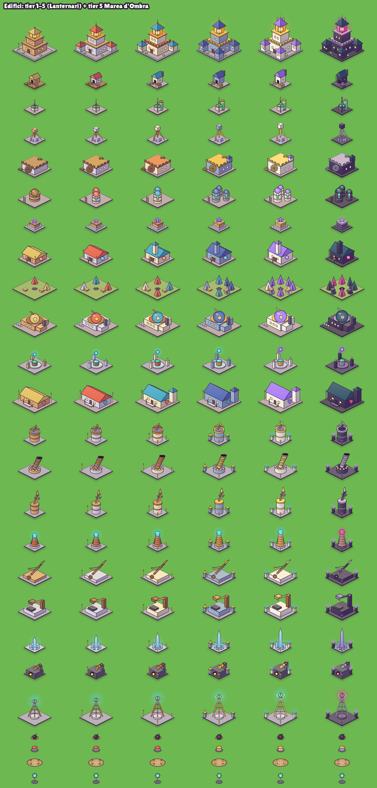
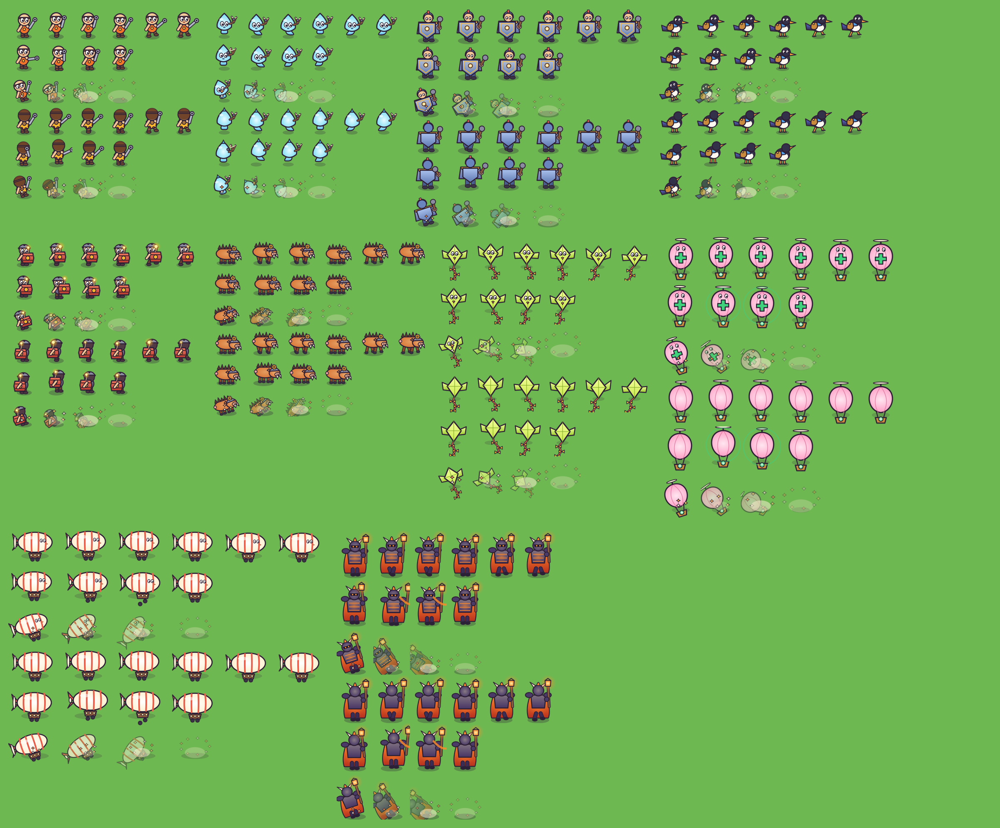
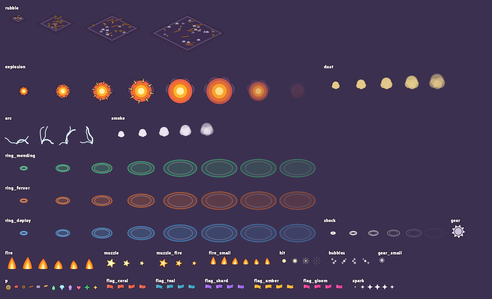
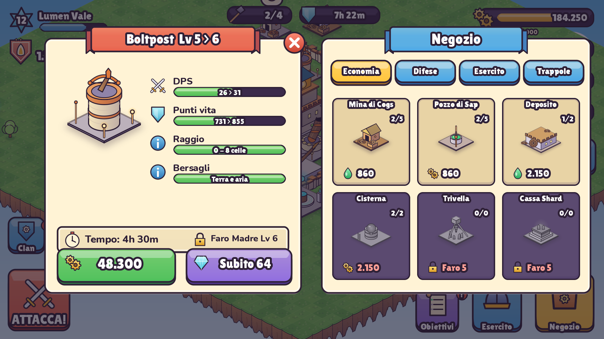
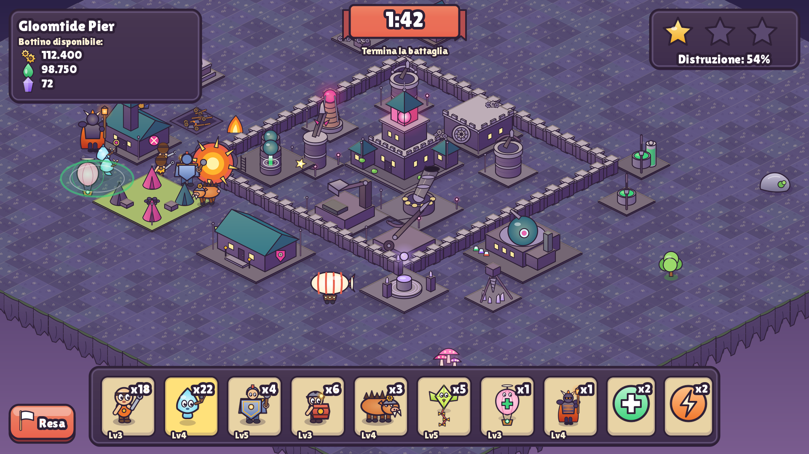
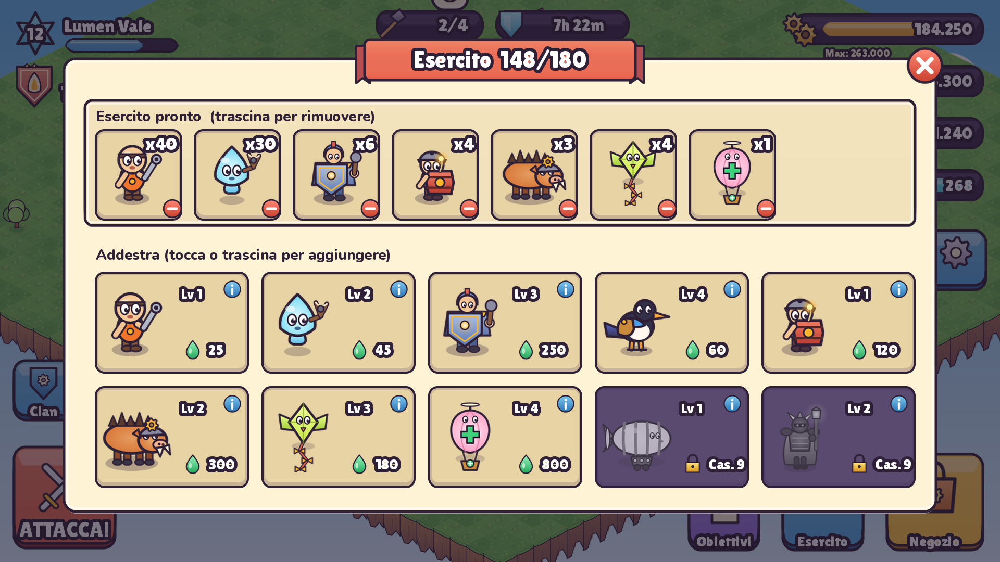
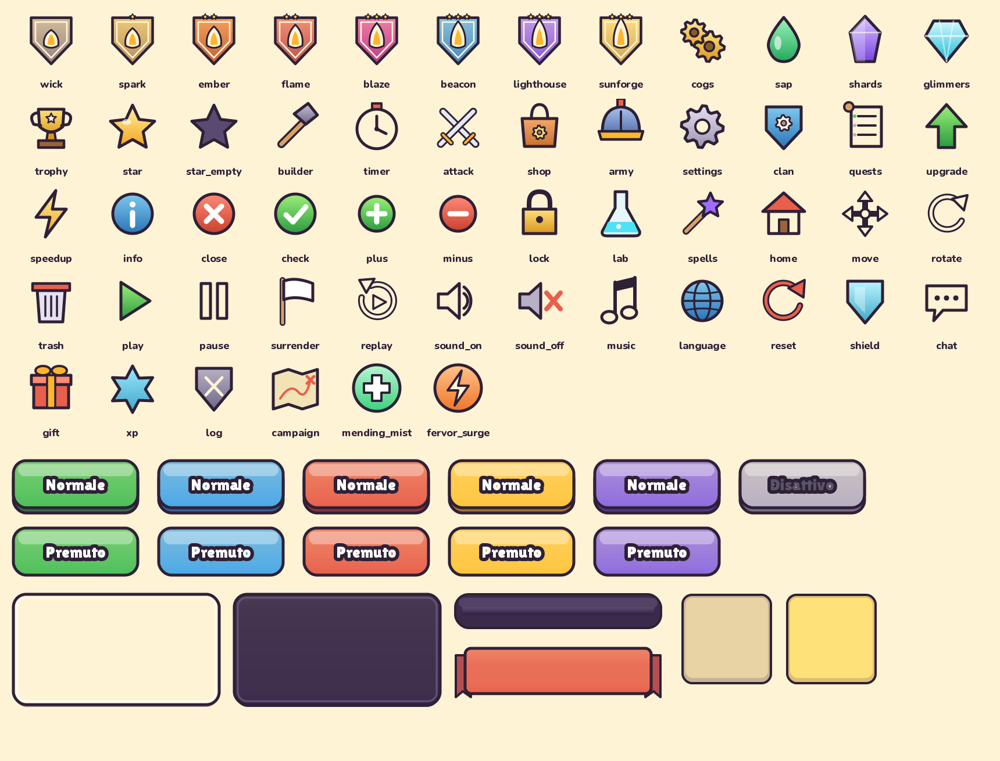

# Lanternreach — Direzione artistica

> Tutti gli asset sono **generati proceduralmente** da `tools/art/` (SVG vettoriale → PNG, sintesi audio numpy).
> Rigenerazione completa: `python3 tools/art/build_all.py` poi `python3 tools/art/preview.py` (requisiti in `tools/art/requirements.txt`).
> Scene di prova e fogli di confronto: [`docs/art/`](docs/art/).



## 1. Visione
**"Fiaba meccanica nel cielo."** Isole sospese, lanterne calde, ingranaggi d'ottone, linfa luminosa. Il giocatore (i **Lanternari**) è colore caldo e luce; il nemico (la **Marea d'Ombra**) è prugna, nebbia e bagliore magenta. Tono giocoso, mai cupo: le truppe "si spengono" in uno sbuffo di stelline, niente sangue.

**Pilastri visivi**
1. **Leggibilità prima di tutto**: silhouette distinte riconoscibili anche a zoom minimo (24–32 px).
2. **Forme morbide e arrotondate**, proporzioni esagerate (teste grandi, armi enormi, tetti alti).
3. **Una sola luce**: sempre da **in alto a sinistra**.
4. **Coerenza procedurale**: tutti gli sprite escono dallo stesso kit (`tools/art/common.py`), quindi spessori, ombre e colori sono identici ovunque.

## 2. Regole di illuminazione e forma
| Regola | Valore |
|---|---|
| Direzione della luce | alto-sinistra |
| Faccia superiore | colore base schiarito **28%** verso giallo caldo `#FFF1B8` |
| Faccia sinistra | colore base (con gradiente chiaro in alto) |
| Faccia destra | colore base scurito **34%** verso viola freddo `#3A2358` (ombre "colorate", mai grigie) |
| Filo di luce | linea 2 px chiara sul bordo alto-sinistro dei volumi |
| Contorno | prugna `#2E2036`, **4 px** a scala 2× (3–3,5 px per i dettagli), giunzioni e terminazioni **arrotondate** |
| Ombra a terra | poligono del footprint sfocato (blur 12 px, opacità 30%, colore prugna) |
| Riflessi | ellisse bianca 35–60% in alto a sinistra su sfere, gemme e cupole |
| Bagliori | gradiente radiale (lanterne, cristalli, orb) — l'unico elemento "luminoso" della scena |

## 3. Palette



### 3.1 Principale (Lanternari)
| Nome | HEX | Uso |
|---|---|---|
| Ink | `#2E2036` | contorni, testo scuro |
| Parchment | `#FFF3D6` | pannelli, testo chiaro |
| Amber | `#FFB62E` | lanterne, **Cogs**, accento primario |
| Ember | `#F0742A` | fiamme, pulsante Attacca |
| Coral | `#E8604C` | tetti, avvisi, pulsanti rossi |
| Sap | `#3FD17C` | risorsa **Sap** |
| Shard | `#A06BFF` | risorsa **Starshards** |
| Glimmer | `#4DE3F5` | valuta **Glimmers**, magia/elettricità |
| Sky | `#7CC8F2` | cielo |
| Grass L/M/D | `#9BD96B` `#6DB852` `#4E9A46` | terreno |
| Earth L/D | `#C48A57` `#8A5A3C` | scogliere, terra |
| Stone L/M/D | `#D5CFE3` `#A59CBC` `#6E6788` | pietra (lavanda, mai grigio neutro) |
| Wood L/D | `#D9A066` `#9C6238` | legno |
| Teal | `#3EA7C9` | tetti tier 3, stendardi |

**Codifica delle risorse**: ogni risorsa ha **colore + forma** propri (Cogs = ingranaggi gialli, Sap = goccia verde, Shards = cristallo viola, Glimmers = gemma ciano), così sono distinguibili anche per chi non distingue i colori.

### 3.2 Marea d'Ombra (fazione nemica, campagna)
| Nome | HEX | Uso |
|---|---|---|
| Void | `#2A2147` | materiali tier 5, cielo |
| Mire | `#4A3558` | muri |
| Mire Light | `#6C4D82` | muri tier 1 |
| Glow | `#E8419A` | bagliori, lanterne nemiche, stendardi |
| Bruise | `#2F7F8F` | tetti |
| Spore | `#C9A8FF` | cristalli |
| Terreno | `#5A4F78` `#605683` `#544A70` `#5D5A7E` | erba-muschio violacea |

Il nemico **non usa mai il verde**, per non confondersi con il Sap.

### 3.3 UI
| Elemento | HEX |
|---|---|
| Pannello / bordo / ombra | `#FFF3D6` / `#2E2036` / `#E8D3A5` |
| Pannello scuro | `#3B2A4A` |
| Pulsante verde (conferma) | `#4CC05A` / `#2C8A3E` |
| Pulsante blu (secondario) | `#4AA8E8` / `#2A74B5` |
| Pulsante rosso (attacco, chiudi) | `#E8604C` / `#A93A2E` |
| Pulsante oro (negozio, scheda attiva) | `#FFC53D` / `#C9881A` |
| Pulsante viola (spendi Glimmers) | `#8E6BE0` / `#5B3FA6` |
| Disattivato | `#B8B0C4` / `#8C849A` |
| Barra vita alleato / nemico | `#58D05A` / `#EB5A46` |

## 4. Griglia e scala degli sprite
- Cella isometrica 2:1. Unità logica 64×32; **gli sprite sono renderizzati a 2× (128×64 per cella)** per restare nitidi sugli schermi 1080p con lo zoom di default.
- Proiezione: `schermo = ((x − y) · 64, (x + y) · 32 − z)` (a 2×).
- Ogni sprite di edificio ha un'**ancora** = centro del rombo del footprint, salvata negli atlas (`anchor`), più le ancore degli **overlay animati** (`overlays`: kind, pos, color).
- Ordinamento di profondità: `x + y + N` (angolo frontale del footprint).

## 5. Edifici
30 tipi (12 edifici, 9 difese, mura, 4 trappole, 4 ostacoli) + 4 cantieri, in **due palette** (Lanternari / Marea d'Ombra).



### 5.1 Tier visivi (cambio d'aspetto ogni 2 livelli)
| Tier | Livelli (10 liv.) | Muri | Tetti | Metallo | Dettagli aggiunti |
|---|---|---|---|---|---|
| 1 | 1–2 | legno `#DDA26A` | paglia `#E3C060` | bronzo scuro | base |
| 2 | 3–4 | pietra lavanda `#D9D3E8` | coppi corallo `#E8604C` | bronzo | stendardo |
| 3 | 5–6 | intonaco crema `#F4E4C1` | tegole teal `#3EA7C9` | rame | torce/lanterne, merli, ciminiere |
| 4 | 7–8 | pietra blu acciaio `#93A9CF` | ardesia blu `#4D66BA` | ottone | pilastri d'angolo, torri extra |
| 5 | 9–10 | marmo `#F6F0E6` | cristallo viola `#A678FF` | oro | cristalli luminosi, corone |

Per edifici con meno livelli (5/6/8) il tier è `1 + ⌊(L−1)·5/maxL⌋` (mappa in `assets/atlas/buildings_manifest.json`). Le altezze crescono del 12% per tier.

### 5.2 Identità delle silhouette
| Edificio | Silhouette |
|---|---|
| Faro Madre | torre a tre piani con lanterna di vetro luminosa, torrette d'angolo dal tier 2 |
| Mina di Cogs | casetta con galleria, ruota dentata rotante, cassa di ingranaggi |
| Pozzo di Sap | pozzo rotondo con linfa verde, trave e secchio; serbatoio di vetro dal tier 3 |
| Trivella Shard | cavalletto a tre gambe con punta, cristalli viola |
| Deposito Cogs | fortino squadrato con portone-cassaforte rotondo |
| Cisterna Sap | 1→3 serbatoi cilindrici con oblò di livello e cupole |
| Caserma | lunga sala con tetto a due falde, emblema spade, bersaglio di paglia |
| Accampamento | 2→8 tende attorno al falò |
| Laboratorio | edificio con cupola-osservatorio, telescopio, provette |
| Forgia Incantesimi | piattaforma runica con calderone e orb fluttuante |
| Sala del Clan | grande casa lunga con stemma e torce |
| Boltpost | torre tonda con balestra |
| Lobber | bunker con sacchi di sabbia e mortaio inclinato |
| Skyspear | torre snella con lancia puntata al cielo |
| Arc Coil | bobina di rame a spire con sfera elettrica |
| Ballista | piattaforma con arco gigante e dardo |
| Thumper | torre con leva e martello enorme sopra l'incudine |
| Frost Spire | ciuffo di cristalli di ghiaccio |
| Cinder Spout | forno di ferro con ugello e bocca incandescente |
| Storm Pylon | traliccio con anello e sfera di fulmini |

### 5.3 Stati
- **Cantiere**: impalcatura per footprint 1–4 (pali, assi, argano con secchio, bandierine), overlay di polvere. In gioco, l'edificio in costruzione mostra il cantiere + barra di progresso ciano.
- **Distrutto**: rovina per footprint 1–4 (macerie, travi, braci) + esplosione + detriti + screen shake.
- **Selezionato**: contorno a rombo crema pulsante sotto la base; in modifica: ghost verde/rosso.

### 5.4 Animazioni idle (overlay)
| kind | Sprite | Frame / fps |
|---|---|---|
| `flag` | bandiera ondeggiante in 5 colori | 4 / 8 |
| `smoke` | sbuffo di fumo che sale | 6 / 8 |
| `fire`, `fire_small` | fiamma | 6 / 12 |
| `gear` | ingranaggio, ruotato via codice | continuo |
| `bubbles` | bollicine (Sap, laboratorio) | 4 / 6 |
| `sparkle` | scintilla a 4 punte (colorabile) | 6 / 18 |
| `arc` | fulmini | 4 / 16 |
| `beam` / `orb` | bagliore pulsante (tween di scala/alpha) | via codice |
| `muzzle`, `impact` | fiammata di sparo / onda d'urto all'attacco | 3 / 24, 6 / 20 |

### 5.5 Mura
Segmenti 1×1 con **16 varianti di connessione** (maschera N/E/S/O) × 5 tier × 2 palette. Pilastro centrale + bracci; dal tier 2 cimasa metallica, dal 4 punte coniche, al 5 gemma.

## 6. Truppe
10 truppe, fogli `assets/sprites/troops/<id>.png` + `troops.json` (dimensione frame, origine ai piedi, righe, fps, loop).



| Animazione | Frame | fps | Note |
|---|---|---|---|
| walk | 6 | 12 | loop, rimbalzo e passo |
| attack | 4 | 10 | caricamento → affondo → ritorno |
| death | 4 | 8 | rotazione, schiacciamento, dissolvenza e sbuffo di stelline |

**Direzioni**: `down` (verso SE, volto visibile) e `up` (verso NE, di schiena) disegnate; **SO e NO** ottenute con `flip_h`, quindi 4 direzioni speculari.

| Truppa | Silhouette e colore chiave |
|---|---|
| Cogling | ometto tondo arancio con occhialoni e chiave inglese, ingranaggio sulla schiena |
| Slingwisp | goccia azzurra fluttuante senza gambe con fionda |
| Bulwark | blocco largo d'acciaio dietro uno scudo a torre con lanterna |
| Magpie | gazza nera/bianca con becco arancio e sacco del bottino |
| Kegger | piccoletto con elmo-pentola e barilotto rosso con miccia accesa |
| Rustjaw | cinghiale ruggine a quattro zampe con zanne ed elmo a ingranaggio |
| Kitewing | aquilone giallo-lime con ali e coda a fiocchi |
| Mender | mongolfiera-lanterna rosa con croce verde e cestino |
| Dirigible | dirigibile crema a strisce coralline con bombe |
| Ember Warden | cavaliere alto viola scuro, mantello di brace, corna, bastone-lanterna |

## 7. Effetti
Atlas `fx`: esplosione (8 frame), onda d'urto, colpo, fiammata, fiamme, fumo, polvere, fulmini, bollicine, anelli d'incantesimo al suolo (cura verde, furore arancio, schieramento blu), particelle (moneta-ingranaggio, goccia, cristallo, gemma, stella, cuore, croce di cura), detriti (legno, pietra, mattone, ingranaggio, asse), rovine 1–4.



**Feedback di gioco** (implementazione in Fase 3, tempi vincolanti):
| Evento | Feedback |
|---|---|
| Raccolta risorse | 6–10 particelle volano verso la barra risorse (arco, 450 ms), contatore animato (conta in 400 ms), barra "pulsa" (scala 1,0→1,12→1,0, 160 ms) |
| Avvio costruzione | polvere ×2, rimbalzo del cantiere (squash 120 ms) |
| Fine costruzione | scintille + anello d'urto + "ding", edificio fa pop (scala 0,85→1,05→1,0, 220 ms) |
| Colpo | flash bianco dello sprite 60 ms + scintilla d'impatto |
| Esplosione/edificio distrutto | esplosione + 8–14 detriti con gravità + rovina + **screen shake** (ampiezza 6 px, 180 ms, decadimento esponenziale; disattivabile in Impostazioni) |
| Stella guadagnata | stella vola al pannello (350 ms) + chime crescente |

## 8. Interfaccia





### 8.1 Tipografia (Google Fonts, licenza OFL)
| Ruolo | Font | Dimensioni (rif. 1920×1080) |
|---|---|---|
| Titoli, numeri, pulsanti | **Lilita One** con contorno Ink 6–12 px | 34–50 px |
| Testo, descrizioni | **Nunito** (variabile, peso 800 per la UI) | 24–32 px (minimo 20 px) |

### 8.2 Layout (riferimento 1920×1080, `stretch_mode = canvas_items`, `aspect = expand`)
| Schermata | Disposizione |
|---|---|
| Villaggio | **alto-sinistra**: livello XP (stella) + nome + barra XP, lega + trofei · **alto-centro**: costruttori liberi/totali, timer scudo · **alto-destra**: 4 barre risorse con icona, valore e capacità · **basso-sinistra**: ATTACCA (200 px, rosso) + Clan · **basso-destra**: Negozio (oro, 190 px), Esercito (blu, 160 px), Obiettivi (viola, 140 px) · Impostazioni a destra |
| Pannello edificio | nastro titolo "Nome Lv X > Y", anteprima sprite, barre statistiche "attuale > successivo", tempo e requisito, pulsanti Potenzia (verde, costo) e Accelera (viola, Glimmers) |
| Negozio | 4 schede (Economia, Difese, Esercito, Trappole) + carte con miniatura, quantità "costruiti/max", costo; carte bloccate scure con lucchetto e requisito |
| Esercito | riga "Esercito pronto" (rimozione con − o trascinamento), griglia di addestramento (tap o trascinamento per aggiungere, info), capacità nel titolo |
| Battaglia | **alto-sinistra**: nome avversario e bottino · **alto-centro**: timer su nastro · **alto-destra**: 3 stelle + % distruzione · **basso**: barra truppe/incantesimi con ritratto, quantità, livello; slot selezionato in oro · **basso-sinistra**: Resa |

### 8.3 Stati dei controlli
- Pulsanti in **5 colori**, ciascuno con stato *normale* e *premuto* (premuto: il corpo scende di 6 px e la base 3D sparisce) + *disattivato* grigio. Il focus da tastiera è invisibile (gioco touch).
- 9-patch in `assets/atlas/ui_0.png` con margini nel JSON; **Theme Godot** generato in `assets/ui/theme.tres` (Button + varianti ButtonBlue/Red/Gold/Purple, PanelContainer, PanelDark, ResourceBar, Slot, ProgressBar, TabContainer, LineEdit, Tooltip, TitleLabel, HudLabel).

### 8.4 Transizioni (massimo 300 ms)
| Transizione | Animazione |
|---|---|
| Apertura pannello | oscuramento 0→60% (150 ms) + pannello scala 0,9→1,0 con `TRANS_BACK`/`EASE_OUT` (220 ms) |
| Chiusura pannello | scala 1,0→0,95 + fade (150 ms) |
| Cambio schermata (villaggio ↔ battaglia) | iris/nuvole che chiudono e riaprono (2 × 250 ms) |
| Pressione pulsante | scala 0,94 (80 ms) e ritorno (120 ms) + `ui_click` |
| Comparsa toast | slide dall'alto + fade (200 ms), permanenza 2 s |

### 8.5 Area touch e leggibilità
- Area touch minima **48 dp = 0,3″ = 7,6 mm**. Il caso peggiore è un telefono 5″ 16:9 (larghezza 4,36″): con stretch `canvas_items` i 1920 px di riferimento coprono 4,36″, cioè 440 px/pollice, quindi **48 dp = 132 px di riferimento** (su un tablet 7″ ne bastano 97). Regola: **ogni controllo interattivo ha un'area di tocco ≥ 132×132 px di riferimento**. Pulsanti principali 140–200 px visivi (Attacca 200, Negozio 190, Esercito 160, Obiettivi 140), slot di battaglia 136×150. Controlli visivamente più piccoli (chiudi 92 px, info 44–54 px, schede alte 84 px) ricevono un'**area di tocco estesa** con un contenitore trasparente di almeno 132 px (`custom_minimum_size`), e tra due aree di tocco ci sono almeno 8 px.
- Testo minimo 20 px di riferimento = 1,15 mm di altezza x su 5″ (~11 pt): usato solo per etichette secondarie; testo informativo ≥ 24 px.
- Verifica a dimensione fisica: [`docs/art/legibility_5in_7in.png`](docs/art/legibility_5in_7in.png).

## 9. Icone
44 icone 96×96 (risorse, navigazione, azioni, stati, audio, lingua…), 8 stemmi lega 128×128 con fiamma crescente e stelline, 2 icone incantesimo, miniature 160×160 di tutti gli edifici e ritratti 128×128 delle truppe.



## 10. Terreno e ambiente
- Tessere erba 128×64 in 4 varianti per palette (ciuffi deterministici), scogliere dell'isola sospesa per i lati SO/SE, evidenziazioni (valido, invalido, selezione, raggio, schieramento, zona vietata), decorazioni (ciuffi, fiori, sassi, funghi, lampioni), 3 nuvole, cielo a gradiente (giorno / Marea d'Ombra).

## 11. Icona app e splash
- Icona: lanterna su cielo blu con ingranaggio dorato e isoletta. **Adaptive icon** Android: `icon_adaptive_fg.png` (432 px, contenuto nel cerchio sicuro) + `icon_adaptive_bg.png`; legacy `icon_192.png` / `icon_512.png`.
- Splash 1920×1080: isola sospesa con la lanterna-faro e il logo "Lanternreach" in Lilita One con contorno.
- **Sequenza di avvio**: lo splash del motore è nero e senza immagine; poi `boot.tscn` mostra "EroideGames" in bianco (Nunito ExtraBold 120 px) su nero per 2 s dissolvenze incluse; poi lo splash di Lanternreach in dissolvenza fa da schermata di caricamento (minimo 1,6 s).

## 12. Audio
- **Musica**: *Village Theme* (100 bpm, Re maggiore, 38,4 s in loop perfetto: pad, arpeggio pizzicato, basso, carillon, shaker) e *Battle Theme* (132 bpm, Re minore, 29,1 s: basso a crome, batteria, ottoni in levare, melodia eroica nella seconda metà).
- **43 effetti** originali: UI (click, back, open/close, error, toggle), raccolta (cogs, sap, shard, gemme), costruzione (avvio, fine, potenziamento, accelerazione), battaglia (schieramento, colpi, balestra, mortaio, antiaereo, esplosione, crollo, mura, fulmine, fuoco, trappole, gelo), magia (cura, incantesimo), punteggio (stella 1-2-3, vittoria, sconfitta, tick timer, gong), notifiche, ricompensa, ostacolo rimosso, morte truppa, freccia, esultanza.
- Formato: WAV mono 16 bit 32 kHz (musica 4,2 MB, effetti 3,1 MB). Livelli: musica a picco −1,4 dBFS normalizzata, effetti a −1,9 dBFS; mix in Godot con **bus separati Master / Music / SFX / UI**, volumi regolabili in Impostazioni.

## 13. Pipeline e convenzioni dei file
```
tools/art/common.py      palette, colori, primitive isometriche, rendering
tools/art/buildings.py   materiali per tier, Faro Madre, utilità
tools/art/b_designs.py   tutti gli altri edifici, difese, trappole, ostacoli, cantieri
tools/art/b_walls.py     mura a 16 connessioni
tools/art/troops.py      personaggi parametrici e animazioni
tools/art/effects.py     effetti e particelle
tools/art/terrain.py     terreno, cielo, decorazioni
tools/art/icons.py       icone e stemmi lega
tools/art/ui.py          9-patch e Theme Godot
tools/art/branding.py    icona app, logo, splash
tools/art/audio.py       sintesi audio
tools/art/atlas.py       impacchettatore atlas (pagine ≤ 2048 px, padding 2 px estruso)
tools/art/build_all.py   orchestratore
tools/art/preview.py     scene di prova e fogli di confronto
```
Atlas e fogli sono versionati in `assets/`; gli script sono deterministici (seed fissi), quindi rigenerare produce gli stessi file.
