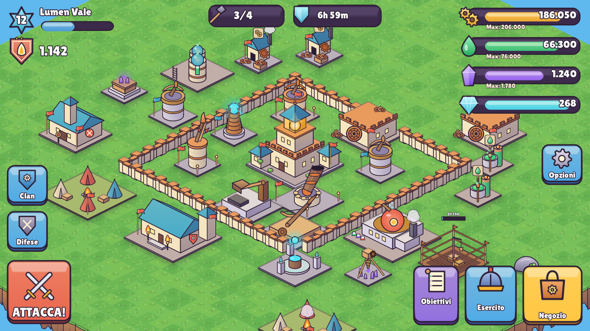
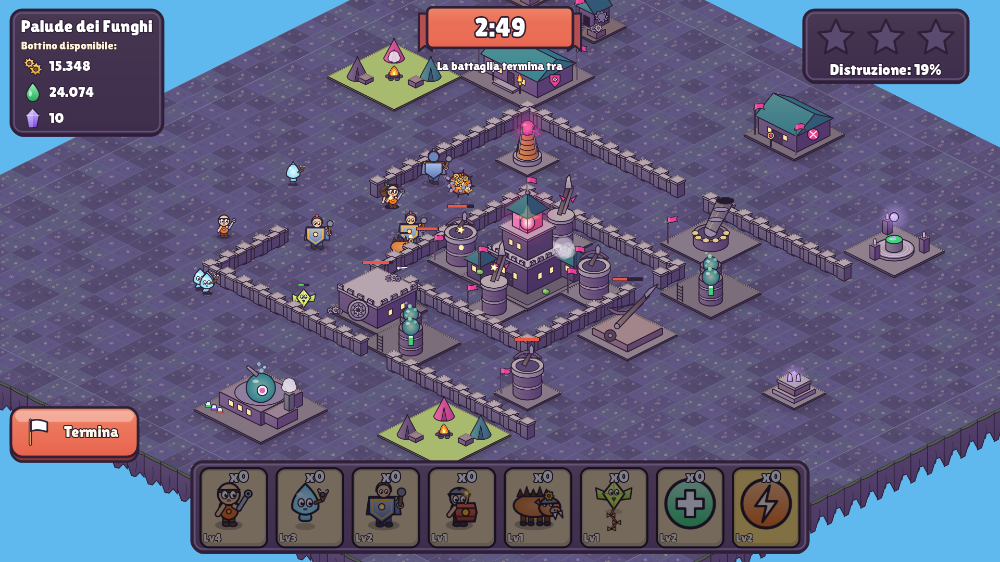
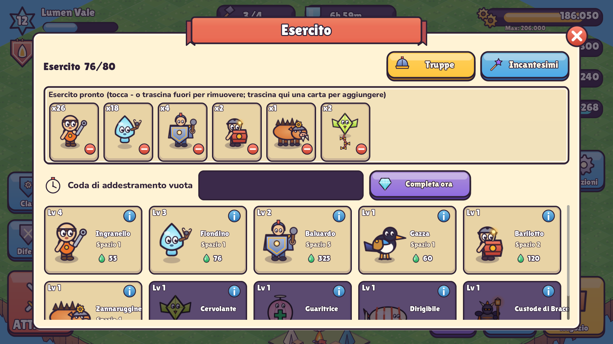
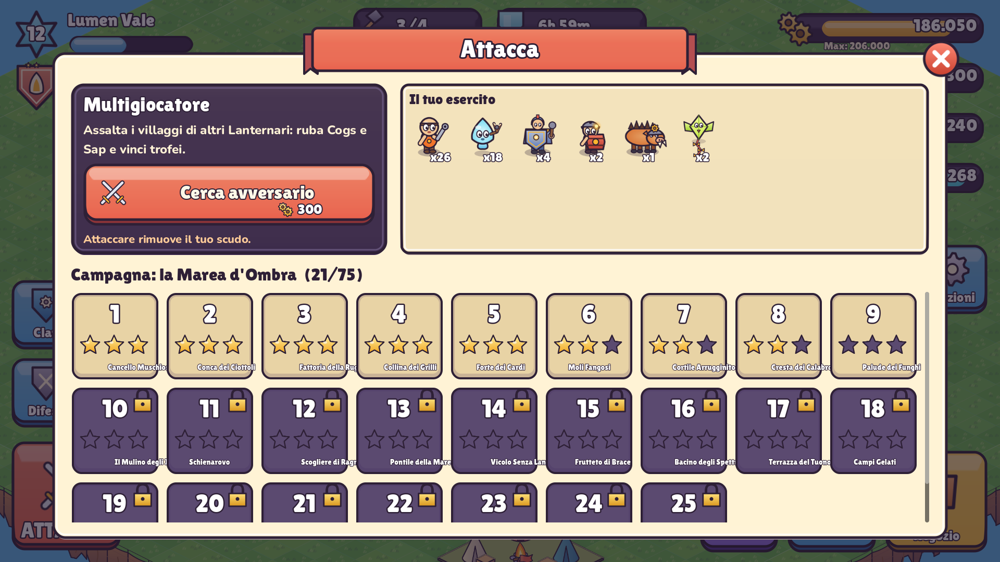

# Lanternreach

[](https://github.com/Eroideches/lanternreach/actions/workflows/android-build.yml)
[](https://github.com/Eroideches/lanternreach/releases/latest)

**Scarica l'APK:** [ultima Release](https://github.com/Eroideches/lanternreach/releases/latest). Ogni push su `main` produce un APK debug firmato, allegato a una Release e disponibile come artifact del workflow.

**Lanternreach** è un gioco di strategia per Android di tipo *base-building* con attacco asincrono, realizzato in **Godot 4.3** (GDScript). Il giocatore ricostruisce un villaggio di Lanternari su un'isola sospesa nel cielo, raccoglie risorse, addestra truppe originali e attacca i villaggi della Marea d'Ombra e le basi di altri giocatori simulate.

Grafica, audio, nomi e testi sono originali: generati dagli script del progetto o scritti apposta. Gli unici asset di terze parti sono i font Google Lilita One e Nunito, con licenza OFL.



| Battaglia | Esercito | Campagna |
|---|---|---|
|  |  |  |

## Caratteristiche
- **Villaggio isometrico** su griglia 44×44: posizionamento dal negozio, long-press per spostare o ribaltare gli edifici, mura tracciate trascinando.
- **Economia**: Cogs, Sap, Starshards (risorsa rara) e Glimmers (valuta premium ottenibile solo giocando). Miniere con capacità interna, depositi saccheggiabili, timer reali che avanzano anche a gioco chiuso, protezione dagli spostamenti indietro dell'orologio.
- **Costruttori**: da 2 a 5, con coda e accelerazione con Glimmers.
- **Edifici**: Faro Madre a 10 livelli che sblocca tutto il resto, 9 difese, mura a 10 livelli, 4 trappole invisibili.
- **Truppe**: 10 truppe in 8 ruoli (mischia, distanza, tank, saccheggiatore, distruttore di mura, anti-difesa, volanti, guaritore, élite) e 2 incantesimi. Caserma, accampamenti e laboratorio.
- **Battaglia**:
  - simulazione deterministica a 30 tick/s con replay;
  - pathfinding A* incrementale con mura "pesate";
  - priorità di bersaglio delle difese e proiettili con traiettoria;
  - stelle (50%, Faro, 100%), saccheggio, timer di 3 minuti.
- **Avversari**: campagna di 25 livelli disegnati a mano e basi procedurali per il PvP simulato. Attacchi subiti offline con scudo e registro difese con replay.
- **Progressione**: trofei e 8 leghe, 16 obiettivi, missioni giornaliere, ciclo di accesso di 7 giorni, livelli del giocatore.
- **Clan**: struttura dati e interfaccia (crea, cerca, entra, chat locale simulata) con interfaccia di servizio pronta per un backend online.
- **Interfaccia e salvataggio**:
  - tutorial interattivo e impostazioni (lingua it/en, volumi, qualità grafica, scossa dello schermo, cancellazione dei dati);
  - salvataggio JSON cifrato con migrazioni di schema;
  - avvio: schermo nero, "EroideGames" per 2 s, splash di Lanternreach, gioco.

## Documentazione
- [GDD.md](GDD.md): game design document con tutti i numeri.
- [docs/BALANCE_TABLES.md](docs/BALANCE_TABLES.md) e [docs/BALANCE_REPORT.md](docs/BALANCE_REPORT.md): tabelle di bilanciamento e verifiche automatiche.
- [ART_DIRECTION.md](ART_DIRECTION.md): direzione artistica, palette, regole di stile, layout dell'interfaccia.
- [CREDITS.md](CREDITS.md): crediti e licenze.
- [DECISIONS.md](DECISIONS.md): scelte di progetto motivate.
- [CHANGELOG.md](CHANGELOG.md): storico delle versioni.
- [docs/screens/](docs/screens/): schermate del gioco reale, catturate da `tools/capture.tscn`.

## Struttura del progetto
```
scenes/            boot (EroideGames), main (splash e caricamento), village, battle
scripts/autoload/  EventBus, Balance, Art, TimeManager, GameState, EconomyManager, Progression,
                   SaveManager, AudioManager, Router
scripts/core/      logica pura e testabile: battle_sim, pathfinder, battle_ai, base_generator,
                   campaign_data, replay, offline_attacks, battle_rewards, clan_service, formulas
scripts/world/     viste: iso, iso_ground, iso_camera, building_view, troop_view, fx_layer, village, battle
scripts/ui/        UIK (kit UI), Modal, HUD, pannelli, tutorial
data/              bilanciamento JSON (+ csv/), layout della campagna
assets/            atlas, fogli truppe, UI e tema, font, audio, icona e splash
localization/      strings.csv (it, en)
tests/unit/        test GUT
tools/             generatori (bilanciamento, campagna, traduzioni, arte, audio) e strumenti di diagnostica
```

## Compilare ed eseguire in locale
1. Installa **Godot 4.3 stable** (desktop) e i relativi **export template**.
2. Apri il progetto (`project.godot`) oppure, da terminale:
   ```bash
   godot --headless --import            # prima importazione delle risorse
   godot                                # avvia il gioco
   ```
3. Test (GUT 9.3, incluso in `addons/gut`):
   ```bash
   godot --headless -s res://addons/gut/gut_cmdln.gd -gdir=res://tests/unit -gexit
   ```
4. APK Android (debug). Il preset usa la build Gradle (minSdk 24, targetSdk 34): servono Android SDK (piattaforma 34, build-tools 34), JDK 17 e il template di build Android (*Progetto > Installa template di build Android*). Configura SDK e keystore di debug in *Editor > Impostazioni editor > Esporta > Android*, poi:
   ```bash
   godot --headless --export-debug "Android" build/lanternreach.apk
   ```
   La CI fa lo stesso in automatico: vedi `.github/workflows/android-build.yml`.

### Rigenerare dati e risorse
```bash
python3 tools/gen_balance.py        # tabelle di bilanciamento + report di verifica
python3 tools/campaign_maps.py      # layout dei 25 livelli della campagna (con validazione)
python3 tools/gen_localization.py   # traduzioni it/en (verifica che ogni chiave esista)
pip install -r tools/art/requirements.txt
python3 tools/art/build_all.py      # grafica (atlas), icone, UI, tema, branding, audio
python3 tools/art/preview.py        # mockup e fogli di confronto in docs/art
```

## Licenze
Codice sotto licenza MIT (vedi [LICENSE](LICENSE)). Grafica e audio originali in CC0. Font Lilita One e Nunito sotto SIL Open Font License 1.1. Godot Engine sotto licenza MIT. GUT sotto licenza MIT. Dettagli in [CREDITS.md](CREDITS.md).
